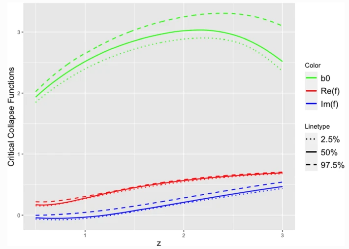

# Analysis of Black Hole Solutions in Parabolic Class Using Neural Networks

This is the official code repository of the work described in our [European Physical Journal C paper](https://doi.org/10.1140/epjc/s10052-023-11781-8). 

  
  
The 95% ANN-based confidence intervals for the critical collapse functions in the four-dimensional parabolic class. The ANN lower (dotted lines), upper (dashed lines) and median (solid lines) bands were computed from 20 replicates with 3000 epochs each.

### License

This repository is released under the GNU General Public License v3.0 License (refer to the LICENSE file for details).

### Citing

If you make use of this data and software, please cite the following reference in any publication:

	@Article{hatefi2023,
	author 	= {Hatefi, E. and Hatefi, A. and L\'opez-Sastre, R.~J.},
	title   = {Analysis of black hole solutions in parabolic class using neural networks},
	journal = {The European Physical Journal C},
	year    = {2023},
	}

